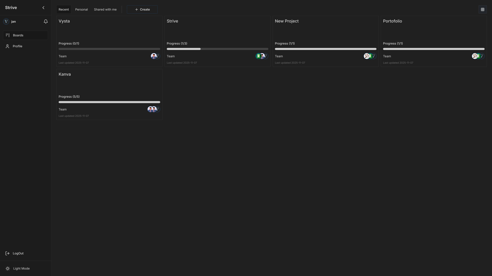
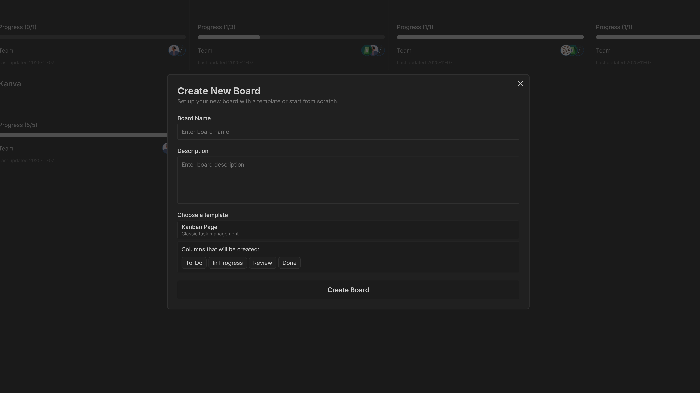
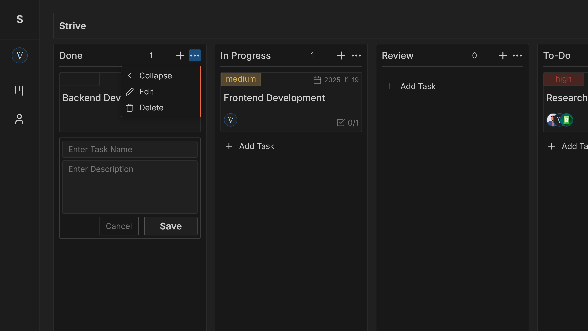
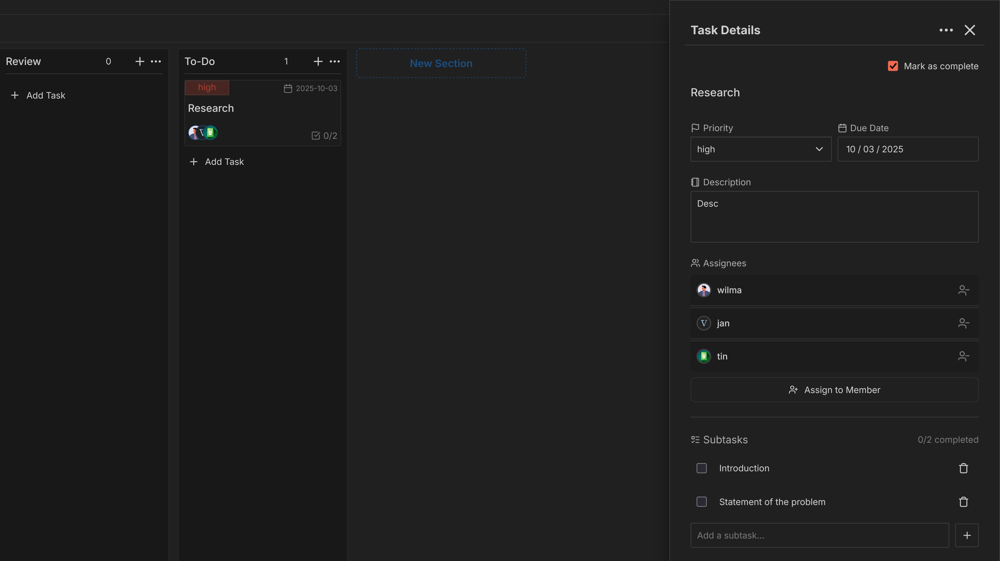
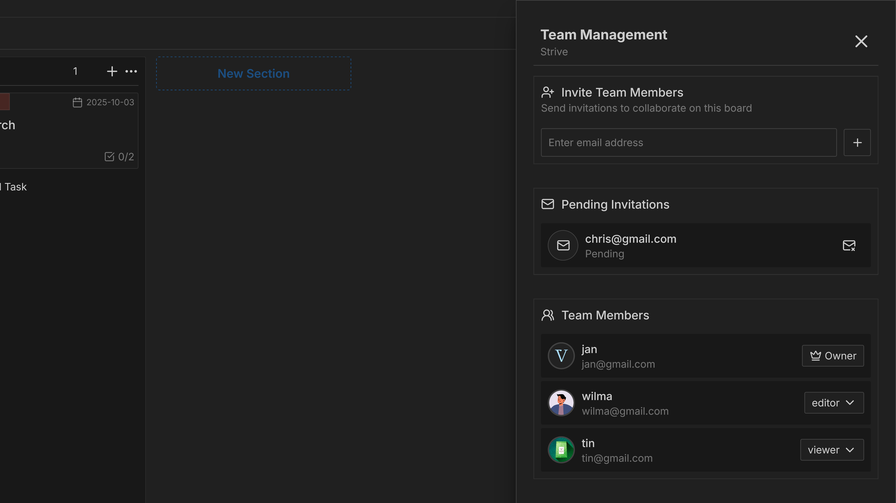
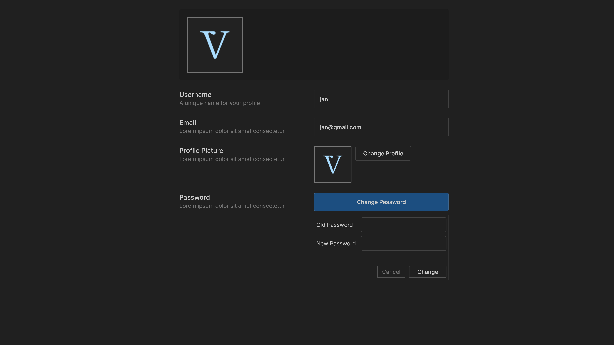

# 🚀 Strive: Your Collaborative Productivity Hub

**Strive** is a powerful and intuitive productivity and Kanban application designed to help individuals and teams organize tasks, manage projects, and achieve goals efficiently. Built with **React** for a dynamic front-end and **Node.js** for a robust backend, Strive supports real-time collaboration to keep everyone on the same page.

---

## ✨ Features

Strive offers a complete set of tools to manage your workflow:

* **Home Dashboard:** Quickly access your recent activity, personal boards, and boards shared with you. A centralized place to start your workday.

* **Board Creation:** Easily create new project boards. Choose from useful **templates** such as:
    * **Kanban:** Perfect for visualizing workflow stages.
    * **Simple Workflow:** Ideal for linear processes (e.g., To Do, In Progress, Done).
    * **Blank Board:** Start from scratch and customize it entirely.

* **Comprehensive Kanban Boards:**
    * **Sections/Columns Management:** Create custom sections (columns) to represent stages in your workflow.
        * **Creation & Editing:** Easily **add new sections** to the board, **rename** existing sections, or **delete** a section when it's no longer needed.
        * **Collapsing:** **Collapse sections** to temporarily hide all tasks within them, keeping complex boards clean and focusing only on relevant stages.
    

    * **Task Management:** Full control over individual tasks with editable fields:
        * Name and Description
        * **Priority** levels
        * **Assignee**
        * **Due Date**
        * **Checklist** functionality for breaking down tasks.
    

* **Intuitive Drag and Drop:** Easily **reorder sections** and **move tasks** between columns for a seamless and highly visual workflow management experience.
* **Real-Time Collaboration:** Invite other users to your boards and experience **real-time updates** as you collaborate on projects.

* **User Profile Management:** Update your personal information, including your **profile picture** and **password**.

---

## 💻 Technology Stack

| Area | Technology | Purpose |
| :--- | :--- | :--- |
| **Frontend** | **React** | Building the dynamic and responsive user interface. |
| **Backend** | **Node.js** , **Express.js** | Handling API requests, business logic, and server-side operations. |
| **Real-Time** | **Socket.IO** | Enabling instant updates for collaborative features. |
| **Database** | **MongoDB** | Persistent storage for user data, boards, and tasks. |

---